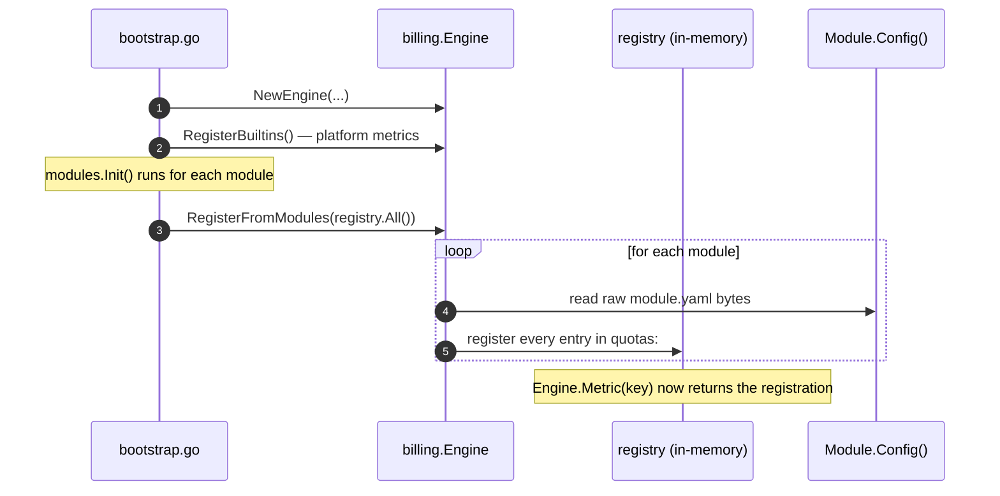

import { Aside } from '@astrojs/starlight/components';

Modules declare every metric they care about under a `quotas:` section in their `module.yaml`. At bootstrap, `billing.RegisterFromModules` parses each module and registers its metrics on the engine. The `Module` field on every registered metric is forced from the registry name — YAML cannot spoof another module's namespace.

## The `quotas:` section

```yaml
# internal/modules/domain/conversations/module.yaml
name: conversations
version: "1.0.0"

quotas:
  - key: feature.whatsapp_channel
    name: WhatsApp channel
    kind: flag
    description: Enables the WhatsApp Business adapter for outbound and inbound messages.

  - key: feature.web_channel
    name: Web chat channel
    kind: flag

  - key: conversations.messages
    name: Messages
    kind: meter
    default_reset: month
    unit: messages
    description: Total messages exchanged in the current billing period.
```

| Field | Required | Type | Description |
|---|---|---|---|
| `key` | yes | string | Globally unique identifier. Convention: `<module>.<metric>` for usage metrics, `feature.<flag>` for capability flags. |
| `name` | yes | string | Human-readable display name surfaced in `/billing/usage` snapshots. |
| `kind` | yes | `counter` \| `meter` \| `flag` | Storage semantics. See [Picking a kind](#picking-a-kind) below. |
| `default_reset` | meters only | `day` \| `month` \| `year` | Rolling-window length. Ignored for counters and flags. |
| `unit` | no | string | Display unit (e.g. `users`, `messages`, `bytes`). |
| `description` | no | string | Tooltip / API documentation copy. |
| `warn_at_pct` | no | int (0..100) | Soft-warning threshold. When usage crosses this fraction of the effective limit the engine fires `billing.quota.threshold_crossed` and Decision.Warning flips to true. See [Soft Limits & Thresholds](/billing/thresholds). |

## Picking a kind

### Counter — absolute resource count

Use when the quota caps the **current number of things** that exist. `Reserve` increments, `Release` decrements, the limit caps the total.

```yaml
- key: tenant.users.count
  name: Users
  kind: counter
  unit: users
```

Examples:

- Number of active members in a tenant
- Number of optional modules enabled
- Number of stored documents

Counters need a pairing call: every successful `Reserve(metric, 1)` must be matched by a `Release(metric, 1)` when the underlying resource is removed. See [Gating with the engine](/billing/gating) for the rollback pattern.

### Meter — usage within a rolling window

Use when the quota caps **usage in a billing period**. The engine windows the value (`day` / `month` / `year`) and rolls it forward when the period expires.

```yaml
- key: conversations.messages
  name: Messages
  kind: meter
  default_reset: month
  unit: messages
```

Examples:

- API calls per month
- Messages sent per day
- Bytes uploaded per month

Two write operations exist for meters:

- `Reserve(metric, amount)` — atomically check + increment. Fails if the new value would exceed the limit.
- `Record(metric, amount)` — increment without checking. Used for telemetry where the caller has already decided to proceed.

`default_reset` is the window the engine uses when no rule or override specifies a different reset period. An override or rule can change the period on a per-tenant basis — for example, a custom plan that meters API calls per **day** instead of per **month**.

### Flag — boolean availability gate

Use when the quota is **on or off**, with no usage tracking. Plan rows store `limit_value = 0` to disable and `> 0` to enable. `IsEnabled(metric)` is the only meaningful read.

```yaml
- key: feature.whatsapp_channel
  name: WhatsApp channel
  kind: flag
```

Examples:

- Feature toggles tied to plan tier
- Optional adapters / channels
- Beta features

Flags read the plan (and any matching rules) but never touch the per-tenant `quota_usage` table — they're free of write contention.

## Naming conventions

Two stable patterns are used across the platform:

| Pattern | When | Example |
|---|---|---|
| `<module>.<metric>` | A metric the module owns and tracks | `conversations.messages`, `documents.exports` |
| `tenant.<resource>` | A cross-cutting platform metric | `tenant.users.count`, `tenant.storage.bytes` |
| `feature.<flag>` | A capability flag (kind: flag) | `feature.whatsapp_channel`, `feature.documents.signing` |

Keep keys lowercase, snake-or-dot-separated, stable across releases. The key is what plan quotas and rules reference — renaming it requires migrating every plan_quota / rule row.

<Aside type="caution">
Only declare metrics your module owns. Cross-cutting platform metrics (`tenant.users.count`, `tenant.modules.enabled`, `tenant.storage.bytes`, `tenant.api_calls`) are registered by the platform itself and should not be redeclared in a module yaml.
</Aside>

## Registration lifecycle



After bootstrap, modules can also call `RegisterMetric` programmatically — useful if a module needs to register a metric whose key is derived at runtime. Idempotent: re-registering the same key is a no-op.

## Inspecting registered metrics

Three engine methods expose the registry:

```go
m := c.Quotas.Metric("conversations.messages") // single metric, or nil
all := c.Quotas.Metrics()                       // every registered metric, sorted by key
snap, _ := c.Quotas.Snapshot(ctx)               // current values + effective limits for the tenant in ctx
```

`Snapshot` is what powers the `/billing/usage` admin endpoint — it returns a `QuotaSnapshot` per registered metric with the same provenance fields as a `Reserve` decision.

## Next steps

- [Gating with the engine](/billing/gating) — call `Reserve` from your service
- [Plans and overrides](/billing/plans) — give your new metric a limit
- [Conditional rules](/billing/rules) — split the limit by runtime attribute
