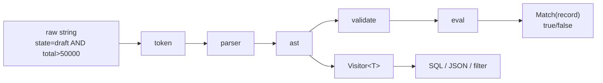

import { Aside } from '@astrojs/starlight/components';

Heyllave ships a single query language shared by every client surface: the search bar in the Web UI, the `?q=` parameter on API endpoints, the CLI `query explain` command, the VS Code extension, and the WASM bundle that runs in the browser. The library lives at [`github.com/heyllave/query`](https://github.com/heyllave/query).

The language is designed for two readers at once:

- **End users** typing into a search bar. No quotes around identifiers, no `==`, no `&&` — just `state=draft AND total>50000`. The literal characters survive a `?q=` round-trip without URL encoding.
- **Backends** that need to push the filter down to PostgreSQL, MongoDB, or an in-memory list. A single AST drives multiple code generators via a typed `Visitor[T]` pattern; see [Code Generation](/query/codegen/).

---

## Quick Example

```go
import (
    "github.com/heyllave/query/eval"
    "github.com/heyllave/query/validate"
)

fields := []validate.FieldConfig{
    {Name: "state", Type: validate.TypeText, AllowedOps: validate.TextOps},
    {Name: "total", Type: validate.TypeDecimal, AllowedOps: validate.NumericOps},
    {Name: "created_at", Type: validate.TypeDate, AllowedOps: validate.DateOps},
}

prog, err := eval.Compile("state=draft AND total>=50000*1.1 AND created_at>=now()-7d", fields)
if err != nil {
    // validation error: unknown field, disallowed operator, type mismatch, etc.
}

prog.Match(map[string]any{
    "state":      "draft",
    "total":      60000.0,
    "created_at": time.Now().Add(-3 * 24 * time.Hour),
}) // true
```

One call compiles, validates, and produces an executable program. `Match` returns `true`/`false` against a `map[string]any` accessor; `MatchStruct` does the same with reflection-backed Go structs.

<Aside type="tip">
For type-safe compilation against a Go struct, use `eval.CompileFor[T]` — field name typos and value-type mismatches are caught at compile time, before any data is evaluated.
</Aside>

---

## Pipeline

A query expression flows through five stages, each living in a focused sub-package:



| Stage | Package | Responsibility |
|-------|---------|----------------|
| Lex | `query/token` | Token types, position tracking, the `Quoted` flag |
| Parse | `query/parser` | Recursive descent → AST; arithmetic, IN, selectors, implicit AND |
| AST | `query/ast` | Node types, `Walk`, `Visitor[T]`, `String` round-trip |
| Validate | `query/validate` | Field config, type compatibility, operator allowlists, custom rules |
| Evaluate | `query/eval` | Compile to closure tree, match against accessors or structs |

The top-level `query` package re-exposes the common entry points (`Parse`, `Validate`, `ParseAndValidate`) so callers that only need parsing can avoid pulling in `eval`.

---

## Where It Runs

| Surface | Entry point | Notes |
|---------|-------------|-------|
| Web UI search bar | WASM (`query/wasm`) | Compiled to `.wasm` and loaded by the TypeScript wrapper; same AST as the server |
| HTTP `?q=` filter | `query.ParseAndValidate` → repository layer | Each repository declares allowed fields via `validate.FieldConfig`. See [Integration](/query/integration/). |
| CLI | `query explain <q>` | AST tree, JSON, or token stream for debugging |
| VS Code extension | WASM bridge to TS extension host | Round-trips through `ast.String` for formatting |
| Custom adapters | `ast.Visitor[T]` | One AST, many outputs — SQL `WHERE`, MongoDB filter, in-memory predicate |

---

## When to Use This vs. expr-lang

This library covers the **search/filter** lane — narrow on purpose so the syntax stays URL-safe and the AST stays easy to translate to other targets. For business-rule evaluation (arithmetic over arbitrary expressions, computed fields, templates) use [`expr-lang/expr`](https://github.com/expr-lang/expr) instead. The [Coverage & Tradeoffs](/query/coverage/) page lays out the deliberate carve-outs.
